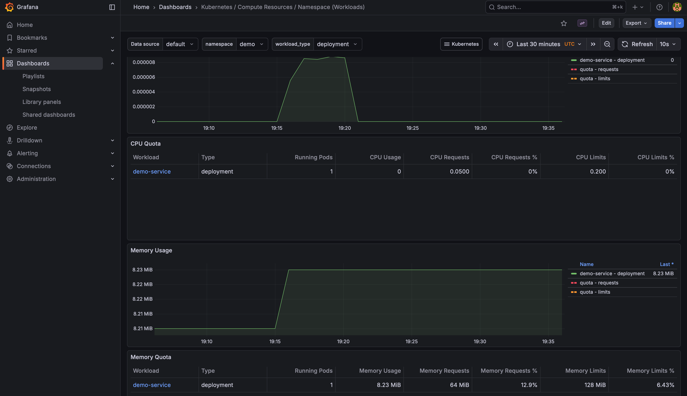
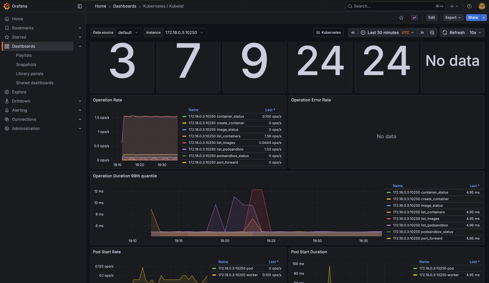
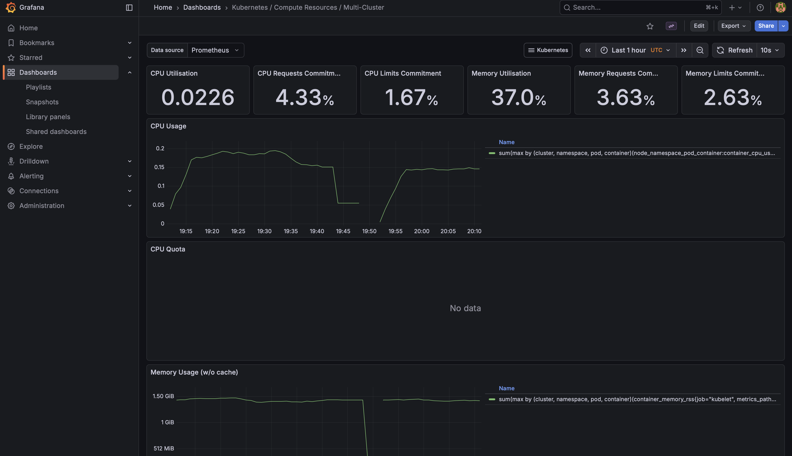
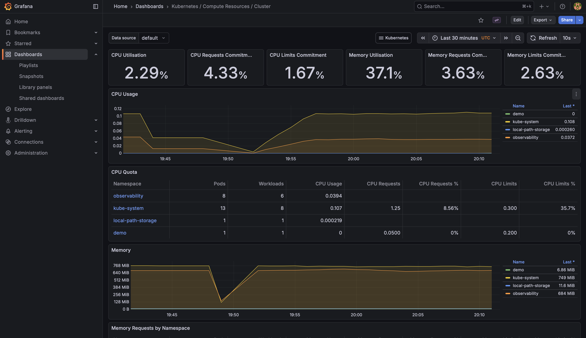
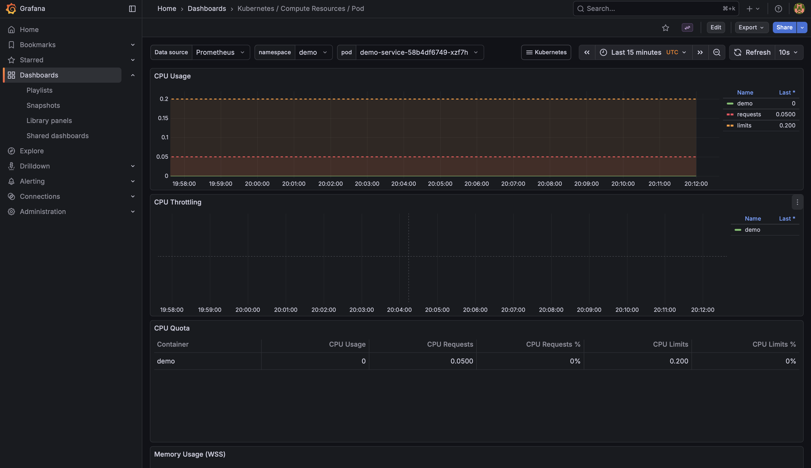

# Grafana Dashboards Screenshots

This directory contains screenshots of Grafana dashboards that provide insights into various aspects of the platform's performance and resource utilization. These dashboards are essential for monitoring and troubleshooting the Kubernetes cluster and its workloads.

---

## 📊 Dashboard Previews

### 1. CPU Usage

*This dashboard displays resource utilization trends, highlighting CPU usage across the cluster.*

### 2. Memory Usage

*This dashboard provides insights into memory consumption over time, helping identify potential memory leaks or bottlenecks.*

### 3. Pod Restarts

*This dashboard tracks restart counts for Kubernetes pods, enabling quick identification of unstable workloads.*

### 4. Network Traffic

*This dashboard visualizes incoming and outgoing network traffic, offering insights into communication patterns and potential bottlenecks.*

### 5. Disk I/O

*This dashboard shows read/write operations, helping monitor disk performance and detect potential issues.*

### 6. HPA Metrics

*This dashboard tracks Horizontal Pod Autoscaler (HPA) metrics, providing visibility into scaling events and resource adjustments.*

---

These dashboards are a critical part of the observability stack, enabling teams to maintain the health and performance of the platform.

